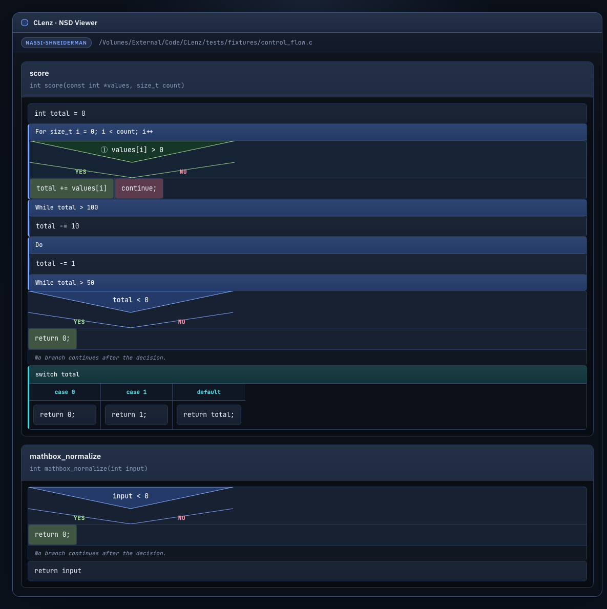
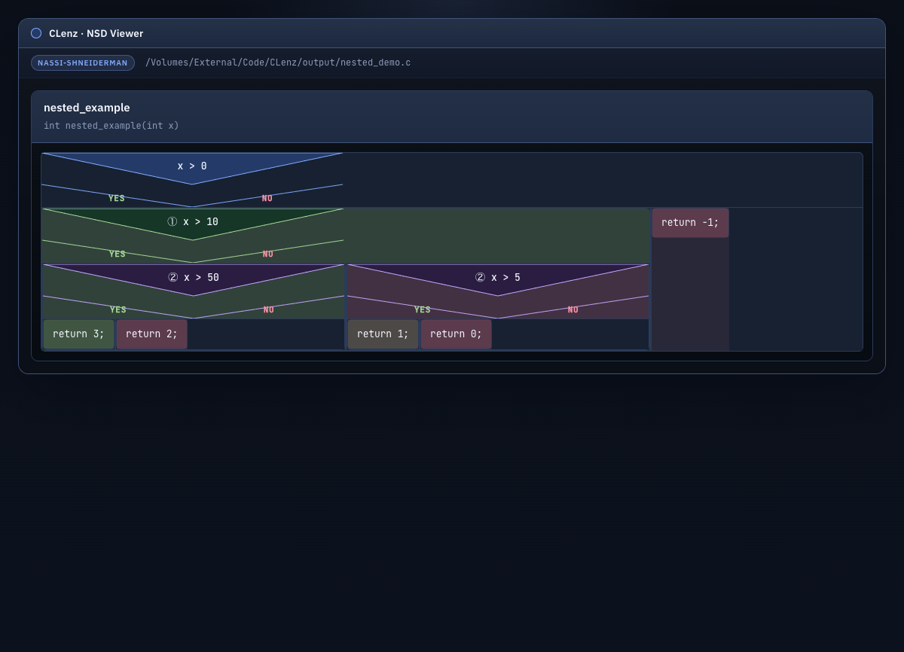

# CLenz

CLenz is a simple, scalable monolith for parsing C source code through ANTLR while keeping the architecture clean enough for future semantic analysis, indexing, and export pipelines.

The project starts from the domain, not from the framework:

* business goal: convert C source into a stable structural model for downstream tooling
* architectural style: DDD-inspired layered monolith with hexagonal boundaries
* parser engine: ANTLR4 with the public C11 grammar from `antlr/grammars-v4`, plus a reproducible Python-compatibility patch step
* current delivery channel: CLI that parses a file or a directory and returns versioned JSON

## What the system does

Today the system supports:

* **Parsing C code**
  * parsing one C file
  * parsing a directory of C files
  * extracting a lightweight structural model: includes, type declarations, functions, variables, and structs
  * reporting syntax diagnostics as part of the contract

* **Control flow extraction**
  * if/else statements with nested branches
  * while loops
  * for loops
  * do-while loops
  * switch/case statements

* **Nassi-Shneiderman diagrams**
  * building a Nassi-Shneiderman HTML diagram for one C file
  * building diagram bundles for entire directories with index page
  * classic NS rendering with SVG triangles for if-blocks
  * depth-coded nested ifs (up to 50 levels with color cycling and Unicode badges ①-㊿)
  * classic switch/case block structure with side-by-side columns
  * dark Tokyo Night-inspired theme with JetBrains Mono font
  * proper text wrapping and responsive layout

* **Code smell scanning**
  * detecting unsafe functions, unchecked mallocs, global variables, long functions, and more

* **Architecture**
  * keeping parser infrastructure behind ports so the application layer stays independent from ANTLR, filesystem, and CLI details

## Diagram Features

The Nassi-Shneiderman diagrams include:

* **Visual clarity**
  * Classic NS triangles for if-blocks with Yes/No labels
  * Horizontal dividers for case blocks with side-by-side columns
  * Color-coded block types (loops=blue, guards=orange, switches=teal, etc.)
  * JetBrains Mono monospace font for code readability

* **Depth awareness**
  * 50 depth levels with cycling colors (blue → green → purple → teal → amber)
  * Unicode circled badges (①-⑩, ⑪-⑳, ㉑-㉟, ㊱-㊿) on nested conditionals
  * Background tinting for deeper nesting levels

* **Dark theme**
  * Tokyo Night-inspired color palette optimized for code readability
  * Proper contrast ratios for comfortable viewing
  - Responsive layout for different screen sizes

* **Smart parsing**
  * Preprocessor directive handling (#include, #define)
  * Fast path for simple function bodies

### Screenshots

**Basic control flow** — loops, guards, and switch/case blocks:



**Nested conditionals** — depth-coded badges and colors for up to 50 nesting levels:



## Architecture

The codebase is split into four explicit layers:

* `domain`: domain model, invariants, ports, and domain events
* `application`: use cases and DTOs
* `infrastructure`: ANTLR adapter, filesystem adapters, event publishing
* `presentation`: CLI contract

See the full design docs in [docs/domain-and-goals.md](docs/domain-and-goals.md), [docs/requirements.md](docs/requirements.md), [docs/system-context.md](docs/system-context.md), [docs/glossary.md](docs/glossary.md), and [docs/architecture.md](docs/architecture.md).

## Quick Start

1. Install dependencies:

```bash
uv sync --extra dev
```

2. Generate the C parser from the vendored grammar:

```bash
uv run python scripts/generate_c_parser.py
```

3. Parse a single file:

```bash
uv run clenz parse-file path/to/File.c
```

4. Parse a directory:

```bash
uv run clenz parse-dir path/to/project
```

5. Build a Nassi-Shneiderman diagram for a C file:

```bash
uv run clenz nassi-file path/to/Algorithms.c --out output/algorithms.nassi.html
```

6. Build Nassi-Shneiderman diagrams for an entire directory:

```bash
uv run clenz nassi-dir path/to/project --out output/nassi-bundle
```

## Constraints and honesty

The current ANTLR grammar is sourced from `antlr/grammars-v4/c` (C11). The upstream grammar targets C11 syntax and may not cover all GCC extensions or platform-specific dialects. CLenz makes those limitations explicit in requirements, ADRs, and runtime metadata so downstream consumers know what contract they are integrating with.

## Next Steps

Useful future extensions:

* richer control flow visualization (function pointers, goto, computed gotos)
* symbol graph export
* semantic passes on top of the structural model
* integration adapters for external analysis tools
* incremental parsing and caching
* interactive HTML diagrams with collapsible nodes
* export to other diagram formats (SVG, PNG, Mermaid)
